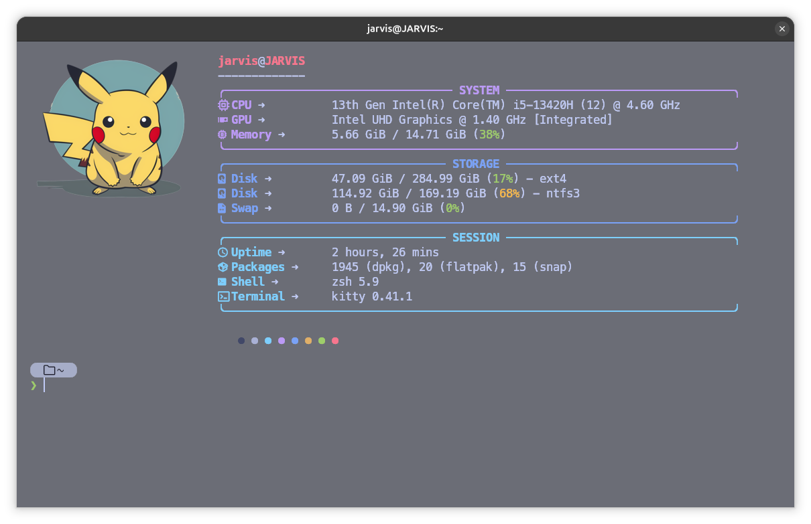

# 💻 My Terminal Setup (Linux Rice)

A clean, minimal, and aesthetic terminal setup using **Kitty + Fastfetch** with a boxed UI, icons, and color-coded sections.

---

## 📸 Preview



---

## ✨ Features

* 📦 Boxed Fastfetch layout
* 🎨 Color-coded sections (System, Storage, Session)
* ⚡ Icons + arrows for a modern UI
* 🧊 Glass-style terminal (transparency + blur)
* 🖼️ Custom image logo (Kitty graphics protocol)
* 💀 Clean and minimal "riced" setup

---

## ⚙️ Requirements

Make sure you have the following installed:

* **Kitty Terminal**
* **Fastfetch**
* **Nerd Font** (for icons)
* A Linux distro (tested on Ubuntu)

---

## 🔤 Font Used

This setup uses a Nerd Font for proper icon rendering.

👉 Recommended:

* **MesloLGS Nerd Font** (install with: `sudo apt install fonts-meslo-lg-nerd-font` or download from https://www.nerdfonts.com/font-downloads)
* or any Nerd Font of your choice

---

## 📂 Repository Structure

```
my-terminal-setup/
 ├── fastfetch/
 │    └── config.jsonc
 ├── kitty/
 │    └── kitty.conf
 ├── screenshots/
 │    └── setup.png
 └── README.md
```

---

## 🚀 Installation

### 1. Clone the repository

```
git clone https://github.com/Priyam792/my-terminal-setup.git
cd my-terminal-setup
```

---

### 2. Install dependencies

```
sudo apt install kitty fastfetch
```

---

### 3. Copy configuration files

```
mkdir -p ~/.config/fastfetch ~/.config/kitty

cp fastfetch/config.jsonc ~/.config/fastfetch/
cp kitty/kitty.conf ~/.config/kitty/
```

---

### 4. Run Fastfetch

```
fastfetch
```

---

## ⚠️ Important Notes

### 🖼️ Change Image Path

The Fastfetch config uses a demo image path:

```
~/Pictures/demo.png
```

👉 You MUST replace it with your own image path:

Example:

```
/home/your-username/Pictures/your-image.png
```

---

### 🎨 Font Requirement

If icons are not showing properly:

* Make sure a **Nerd Font** is installed
* Set it in your terminal settings

---

### 🧊 Blur / Transparency

Blur effect depends on your desktop environment (GNOME extensions like Blur My Shell).

---

## 🎯 Customization

You can:

* Change colors in Fastfetch config
* Modify box width
* Replace icons
* Use your own image

---

## 📜 License

This project is licensed under the **MIT License**.

---

## 😎 Author

Made with 💀 by **Priyam792**

---

## ⭐ If you like this setup

Give it a ⭐ on GitHub and feel free to fork!
